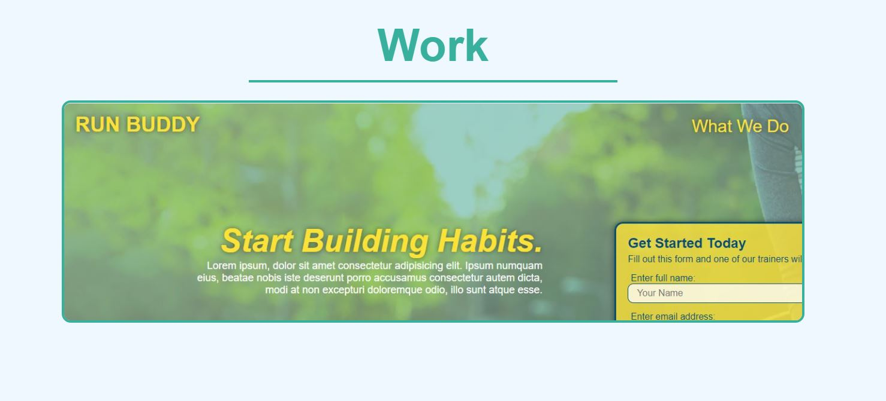

# Portfolio

Welcome to my Portfolio.

## Table of Contents

* Intro
* About Me
* Work
* Contact Me

## Intro

* Header section with navigation links to each of the following: About Me, Work, Contact Me, Resume.
* Clicking each navigation link will take the user to the corresponding section in the webpage. Clicking the resume will direct the user to pdf file containing my resume.
* Users will also be presented with a recent profile picture.

## About Me

I'm a software developer based out of San Antonio, Texas. I specialized in building websites using HTML and CSS code. Having a background in engineering and customer relations, I have develop important problem solving skills throughout the years. These skills have transformed me into the software developer I am today. I have a Bachelor's Degree in Mechanical Engineering from Texas A&M University. I spent the first 5 years post-graduation working on communication/speaking skills working in the retail automotive industry. Since then, I am pursuing a software development certificate from University of Texas at San Antonio. My personal interests include travelling and video gaming. I am passionate about both and plan to pursue a career in software in one of those two industries. Incorporating both industries would be ideal.

Below is a list of work to showcase my skills as a developer. You will see a link to Run-Buddy, an interactive website designed to encourage people to participate in a fitness program. Using HTML and CSS, potential customers are provided with a website that is informative, engaging, and responsive. Click on the link below to see just how the website works.

## Work

Here users will find a link to my work displaying my talents as a software developer. The user will just need to simply hover over the picture and click it. This will take the user to the full website. Below is a screenshot of what the user will see:

(Placeholder images are in place where future projects will be displayed.)

## Contact Me

Here users will be displayed with 3 ways to contact me if needed.
* Phone - 830.299.2545
* Email - wiatrektyler@yahoo.com
* GitHub - https://github.com/TylerWiatrek

Clicking the e-mail link will allow the user to directly e-mail me using whatever default e-mail application is on their current device. Clicking the GitHub link will take the user to my GitHub page.

